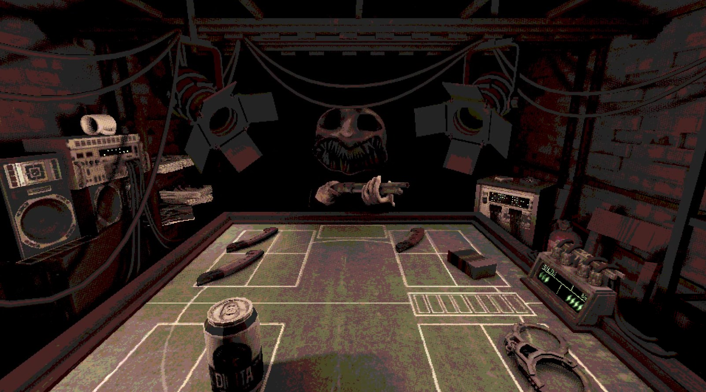
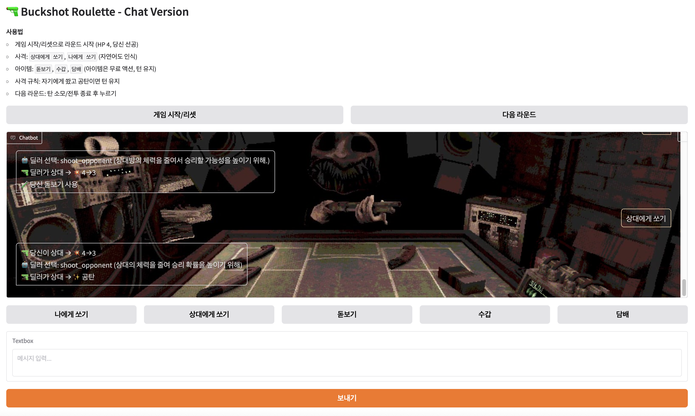
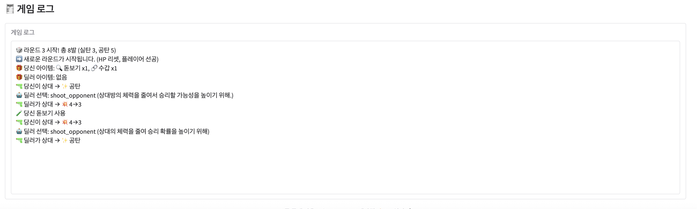
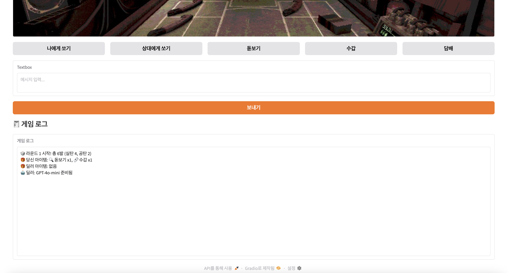

# 🔫 버크샷 룰렛 챗봇 (Buckshot Roulette - Chat Version)
### 🎲 Gradio와 GPT-4o-mini로 구현한 텍스트 기반 인터랙티브 게임

  

## 📌 프로젝트 소개
유명한 인디 게임인 **버크샷 룰렛(Buckshot Roulette)**의 핵심 규칙을 텍스트 챗봇 기반으로 완벽히 재현한 프로젝트입니다. 
단순한 룰렛 게임을 넘어 **OpenAI GPT-4o-mini** 언어 모델의 추론 능력과 **Gradio**의 직관적인 웹 인터페이스를 결합하여, 유저는 자연어로 AI와 긴장감 넘치는 데스매치를 진행할 수 있습니다. 

- **원작 출처**: [Steam - Buckshot Roulette](https://store.steampowered.com/app/2835570/Buckshot_Roulette/?l=koreana)
- **게임 상세 룰**: [나무위키 - Buckshot Roulette](https://namu.wiki/w/Buckshot%20Roulette)

## ✨ 핵심 기능
- **자연어 인식 사격**: 버튼 클릭뿐만 아니라 "나에게 쏴", "상대방 쏴"와 같은 자연어 명령어를 AI가 이해하고 턴을 진행합니다.
- **탄환 및 턴 시스템 구현**: 실탄과 공포탄의 무작위 배치 구조(탄창 섞기), 공포탄을 자신에게 쏘았을 때의 추가 턴 제공 등 원작의 정교한 룰을 스크립트로 완벽 구현했습니다.
- **전략적 아이템 시스템**:
  - 🔍 **돋보기**: 무료 액션. 다음 탄이 실탄인지 공포탄인지 은밀히 확인합니다.
  - 🔗 **수갑**: 사용 즉시 발동. 다음 턴 상대방의 행동을 강제로 스킵 시킵니다.
  - 🚬 **담배**: 체력을 1 회복합니다. (최대 HP 4 제한)

## 📺 게임 플레이 화면

  
   
  
   
  

## 🚀 플레이 지침
1. **라운드 시작**: 양측은 최대 체력 4로 시작하며, 유저(당신)가 선공을 가져갑니다.
2. **사격 선택**: 상대방에게 쏠지, 나에게 쏠지 신중하게 결정하십시오.
   - 피격 시 HP 1 감소
   - 자신에게 공포탄 발사 시 턴이 소모되지 않음
3. **아이템 활용**: 불리한 상황을 타파하기 위해 각 라운드에 주어지는 아이템을 전략적으로 섞어 사용하세요.

---
*본 프로젝트는 생성형 AI의 게임화 및 자연어 인터페이스 적용 가능성에 대한 탐구의 일환으로 [우진(Woojin Choi)](https://github.com/CHUH00)에 의해 개발되었습니다.*
