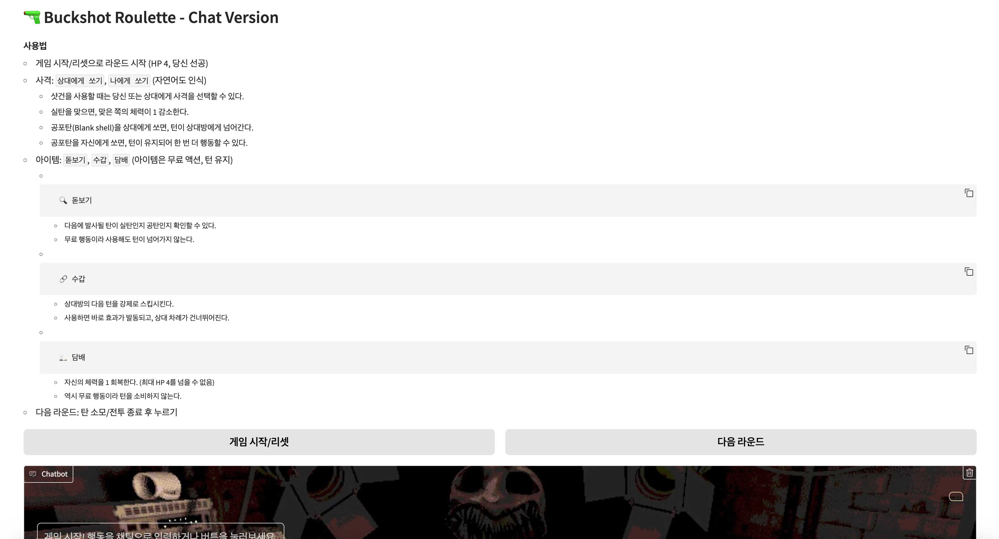
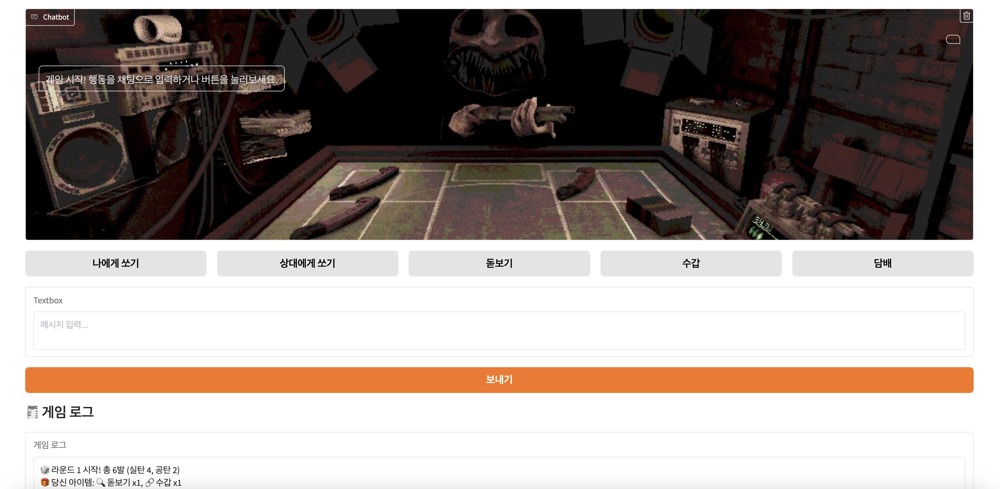

# Buckshot Roulette – Chat Version

  

- 출처: https://store.steampowered.com/app/2835570/Buckshot_Roulette/?l=koreana
- 게임에 대한 자세한 설명: https://namu.wiki/w/Buckshot%20Roulette

---

Gradio + OpenAI(gpt-4o-mini)로 만든 **버튼/채팅 기반 버크샷 룰렛**.  
라운드, 탄창 섞기, 아이템(돋보기/수갑/담배), 벅샷 룰렛 규칙까지 구현.

---

## 사용법
- 게임 시작/리셋으로 라운드 시작 (HP 4, 당신 선공)
  
- 사격: `상대에게 쏘기`, `나에게 쏘기` (자연어도 인식)
    - 샷건을 사용할 때는 당신 또는 상대에게 사격을 선택할 수 있다.
    - 실탄을 맞으면, 맞은 쪽의 체력이 1 감소한다.
    - 공포탄(Blank shell)을 상대에게 쏘면, 턴이 상대방에게 넘어간다.
    - 공포탄을 자신에게 쏘면, 턴이 유지되어 한 번 더 행동할 수 있다.
    
- 아이템: `돋보기`, `수갑`, `담배` (아이템은 무료 액션, 턴 유지)
    -	🔍 돋보기
        - 다음에 발사될 탄이 실탄인지 공탄인지 확인할 수 있다.
        - 무료 행동이라 사용해도 턴이 넘어가지 않는다.
    -	🔗 수갑
        - 상대방의 다음 턴을 강제로 스킵시킨다.
        - 사용하면 바로 효과가 발동되고, 상대 차례가 건너뛰어진다.
    -	🚬 담배
        - 자신의 체력을 1 회복한다. (최대 HP 4를 넘을 수 없음)
        - 역시 무료 행동이라 턴을 소비하지 않는다.
        
- 다음 라운드: 탄 소모/전투 종료 후 누르기

---

## 실행 화면

  

  

  

